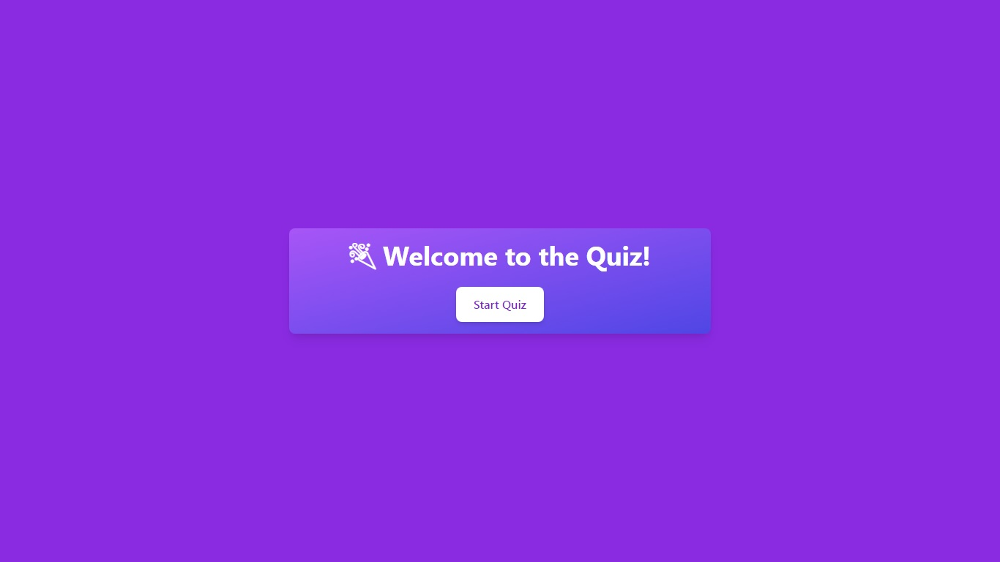
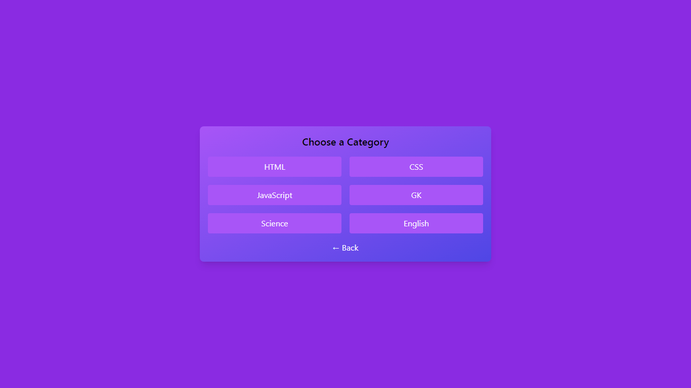
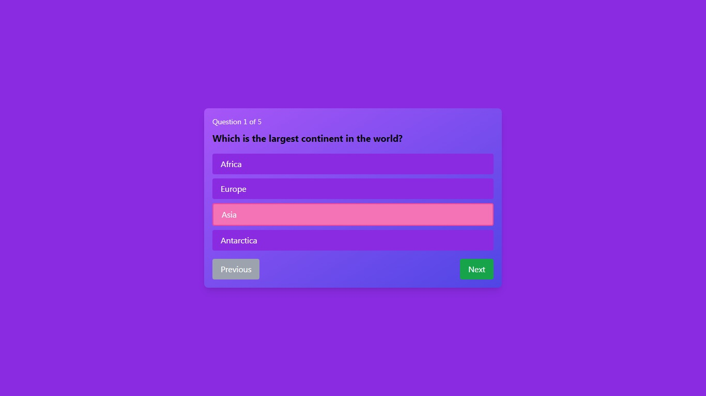

# 🎯 Quiz App

Welcome to the **Quiz App** – a sleek, responsive, and interactive web-based quiz dashboard built with **HTML**, **Tailwind CSS**, and **JavaScript**.

## Home

## Categories

## Questions

## Result


---

## 🚀 Features

- ✅ Clean and attractive **dashboard UI**
- 📚 Category-based questions: HTML, CSS, JavaScript, GK, Science, English, Social Studies
- 🔢 **Dynamic question loading** from `quiz_data`
- ⏭️ Navigate with **Next / Previous** buttons
- 📊 Final **score with results**:
- 📱 Fully **responsive** for all devices

---

## 🛠️ Tech Stack

- **HTML5**
- **Tailwind CSS**
- **Vanilla JavaScript**

---

## 📦 Getting Started

Clone the repo and run it locally with Live Server or open `index.html` directly in your browser.

```bash
git clone https://github.com/your-username/quiz-app.git
cd quiz-app
